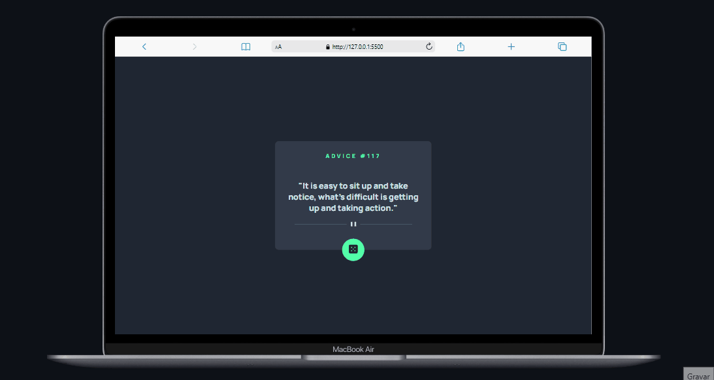

# Advice Generator APP 

## Bem-vindos! 👋

Este projeto foi desenvolvido para o desafio do Frontend Mentor, cujo objetivo principal é construir um aplicativo capaz de gerar conselhos aleatórios. É um projeto perfeito para quem está aprendendo a interagir com APIs de terceiros. Neste desafio, utilizamos a Advice Slip API para obter citações aleatórias de conselhos.

O objetivo deste projeto é praticar e aprimorar minhas habilidades em HTML, CSS, JavaScript e aplicação de APIs, além de colocar em prática os conceitos aprendidos em design responsivo.

## Funcionalidades
Geração de conselhos aleatórios: O aplicativo consome a Advice Slip API para obter conselhos aleatórios sempre que o usuário clicar no botão.

## Tecnologias utilizadas

- Marcação HTML5 semântica
- Propriedades personalizadas CSS
- Flexbox
- JavaScript

## Como executar o projeto

1. Faça o download ou clone este repositório.

- git clone https://github.com/vandesonsantos/advice-generator-app.git

2. Abra o arquivo `index.html` em seu navegador web.
3. A clik no botaõ, um novo conselho aleatório será gerado.

## Estrutura do projeto

    ├── index.html
    ├── src 
    │   ├── css
    │   │   └── style.css
    └── └── js
            └── index.js

- `index.html` : Arquivo principal que contém a estrutura HTML do aplicativo.
- `css/style.css` : Arquivo de estilo CSS responsável pela aparência do aplicativo.
- `js/script.js` : Arquivo JavaScript responsável pela interação com a API e manipulação dos dados.

## Contribuindo

Contribuições são sempre bem-vindas! Se você deseja contribuir com este projeto, siga as etapas abaixo:

- Faça um fork deste repositório.
- Crie um novo branch com a sua contribuição.
- Faça as modificações desejadas.
- Envie um pull request com as suas alterações.

## Deploy project

- [GitHub Pages](https://vandesonsantos.github.io/advice-generator-app/)

**Divirta-se!** 🚀
